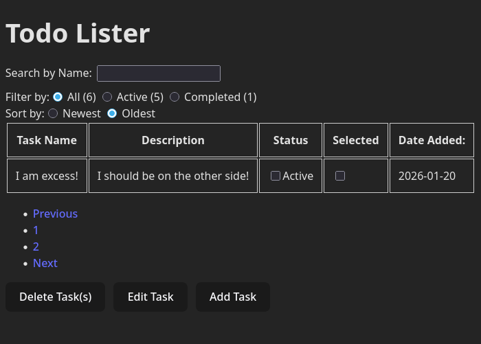

# React.JS TO-DO List Application
This repository contains the source code for a barebones to-do list implemented using React for JavaScript which serves as one of this user's exploratory project into web development using React. A pre-populated dataset is hardcoded into main.jsx to assist in demonstrating the features of this application.

As of current date, this application can only be run through a local development server such as Vite.

## Features
Implemented for this application are the following features:
- Add a new entry.
- Mark entry as either complete/incomplete.
- Count of total, active, and completed tasks in list.
- Update entry name and/or description.
- Delete entry.
- Search entry by name (using a search bar).
- Filter entries by "All", "Active", "Completed".
- Use of localStorage for data persistence of entries.

